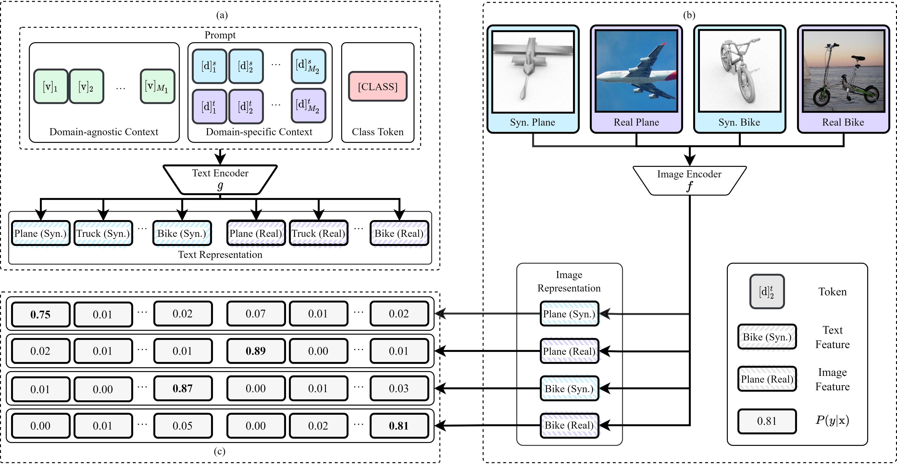

# Domain Adaptation via Prompt Learning


<div align="center">Overview of Domain Adaptation via Prompt Learning (DAPL)</div>

[[Paper]](https://arxiv.org/abs/2202.06687) [[Code]](https://github.com/LeapLabTHU/DAPrompt)

Domain adaption via prompt learning (DAPL), extends from CLIP and CoOp, offers a simple solution to the domain adaption problem. The prompt consists of three parts: domain-agnostic context, domain-specific context, and class label (token). 
- The domain-agnostic context represents general task information and is shared among all images. 
- The domain-specific context represents domain information and is shared within each domain. With domain-specific context modeling the discrepancy between domains, our model is able to discard domain alignment. 
- The class label distinguishes different categories.

Our method is to tailor the powerful CLIP for UDA by designing trainable domain-agnostic, domain-specific and class prompt. By learning the representation of the prompt, our method actually learns a conditional propability distribution to deal with distribution shift. Hence, our method learns different decision boundaries for each domain. Moreover, we show that this allows disentanglement of semantic and domain representation with contrastive learning. 

## How to Install

Our code is built based on the source code of [CoOp](https://github.com/KaiyangZhou/CoOp). So you need to install some dependent environments. 

```python
# install clip
pip install ftfy regex tqdm
pip install git+https://github.com/openai/CLIP.git

# clone dapl
git clone https://github.com/LeapLabTHU/DAPrompt.git

# install dassl
cd dassl
pip install -r requirements.txt
pip install .
cd ..

# you may download clip weights and modify the path to clip weights in clip file, or it could be downloaded automatically
```
You may follow the installation guide from [CLIP](https://github.com/KaiyangZhou/CoOp) and [dassl](https://github.com/KaiyangZhou/Dassl.pytorch).

## Download Datasets

**VisDA** is a dataset from VisDA 2017 challenge. It contains two domains, *i.e.*, 152397 synthetic images and 55388 real images.

[Home page for VisDA dataset](http://ai.bu.edu/visda-2017/)

[Download the VisDA-classification dataset](http://ai.bu.edu/visda-2017/#download)

**Office-Home** is a dataset comprised of 4 domains and 65 categories. It has a total of  15,588 images. 

[Home page for Office-Home dataset](https://www.hemanthdv.org/officeHomeDataset.html)

[Downliad the Office-Home dataset](https://drive.google.com/file/d/0B81rNlvomiwed0V1YUxQdC1uOTg/view?resourcekey=0-2SNWq0CDAuWOBRRBL7ZZsw)

## How to Run

We provide the running scripts in `scripts/`. Make sure you change the path in `DATA` and run the commands under `CoOp/scripts/`.

### Training
The commond is in the file `DAPL/scripts/main.sh`, which contains six input arguments:
- `DATASET` takes as input a dataset name, like `visda` or `officehome`. The valid names are the files' names in `DAPL/configs/datasets/`. The names of dataset, source domain and target domain is defined in the file. The visual backbone is also defined in the yaml. file for the common visual backbone is related to dataset. You may follow these files to establish new datasets;
- `CFG` means which config file to use, such as `ep25-v0-32` (see `DAPL/configs/trainers/DAPL/`). The implemntation details are included in this file. You may modify the hyper-parameters in the file;
- `T`: is a temperature in the Eq. 1;
- `TAU`: is the pseudo label threshold in Eq. 9;
- `U`: is a coeffcient term of $\mathcal{L}_u(\mathcal{D}^d)$ in Eq. 10;
- `NAME`: defines the name of the task. 

Below we provide examples on how to run DAPL on VisDA-2017. The file `DAPL/scripts/main.sh` defines the path to dataset in the line 6. You may set it as the true path to your dataset. If you want to train DAPL on the VisDA-2017 dataset, you may run the below command in the path `DAPL/scripts`:
```bash
bash main.sh visda17 ep25-32-csc 1.0 0.5 1.0 t0
```

### Load a pre-trained Model
The command is 
```bash
bash eval.sh visda17 ep25-32-csc 1.0 0.5 1.0 t0
```

## How to Develop New Algorithm

The structure of our lib:
- configs: the config file for datasets and trainers;
- dataset: the definition of datasets;
- scripts: bash command to train;
- trainers: the main file for training.

If you want to define a new method `NewDA`, you may need to develop the project according to the following guide:
- Implement the method in the `DAPL/trainers/newda.py`. The method should inherit the class *TrianerXU* (in the lib `dassl/dassl/engine/trainer.py`), and you may rewrite some functions: *build_model, run_epoch, forward_backward, test*. We recommand you to inherit the methods from *TrianerXU*;
- Import your method in the file `DAPL/trainers/__init__.py`; 
- Import your method in the file `DAPL/train.py`;
- Make a new folder `DAPL/trainers/NewDA/` and define the config file in the file `DAPL/trainers/NewDA/ep25.yaml`. You can name the yaml. file according to the hyper-parameters;
- Replace the "TRAINER" in the `DAPL/scripts/main.sh` with your new method(e.g. NewDA);
- You could run you code on VisDA-2017 by the command: 
```bash
bash main.sh visda17 ep25 1.0 0.5 1.0 t0
```

If you want to add new dataset `NewData`, you may follow:
- Define a new dataset in the `DAPL/datasets`;
- Import your new dataset in the file `DAPL/datasets/__init__.py` and `DAPL/train.py`;
- Define the hyper-parameters of the dataset in the `DAPL/configs/datasets/NewData.yaml`;
- Replace the "DATA" in the `DAPL/scripts/main.sh` with your new dataset path(e.g. NewData). 

For new algorithm development, there are some dependency useful to read:
- `dassl/dassl/engine/trainer.py`: defines the class *TrainerXU*;
- `dassl/dassl/config/defaults.py`: defines the default configs;
- `dassl/dassl/data/data_manager.py` and `dassl/dassl/data/samplers.py`: define the dataset and dataloader;
- `dassl/dassl/engine`: defines some da/dg/ssl methods. 

## Acknowledgement
Thanks for the following projects:
- [CLIP](https://github.com/openai/CLIP)
- [Dassl](https://github.com/KaiyangZhou/Dassl.pytorch)
- [CoOp](https://github.com/KaiyangZhou/CoOp)

## How to Contect [Us](https://john-ge.github.io/)
You can send an e-mail to gecj20 at mails.tsinghua.edu.cn if you have queations. 

## How to Cite DAPL
If you use this code in your research, please kindly cite the following paper

```bash
@article{ge2022domain,
  title={Domain Adaptation via Prompt Learning},
  author={Ge, Chunjiang and Huang, Rui and Xie, Mixue and Lai, Zihang and Song, Shiji and Li, Shuang and Huang, Gao},
  journal={arXiv preprint arXiv:2202.06687},
  year={2022}
}
```
